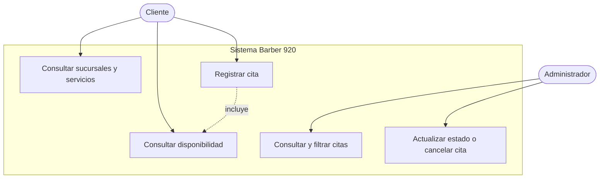

# Diagrama de casos de uso

**Estado:** propuesta de diseño basada en los requerimientos preliminares.

## Descripción resumida

| Caso | Actor | Resultado esperado |
|---|---|---|
| UC-01 Consultar sucursales y servicios | Cliente | Visualiza información útil para elegir dónde y qué reservar. |
| UC-02 Consultar disponibilidad | Cliente | Obtiene fechas y horarios disponibles. |
| UC-03 Registrar cita | Cliente | Registra sus datos y recibe una confirmación. |
| UC-04 Consultar y filtrar citas | Administrador | Visualiza reservaciones por fecha y sucursal. |
| UC-05 Actualizar o cancelar cita | Administrador | Mantiene actualizado el estado de las reservaciones. |

Los casos deberán ajustarse después de validar las reglas con Barber 920.
