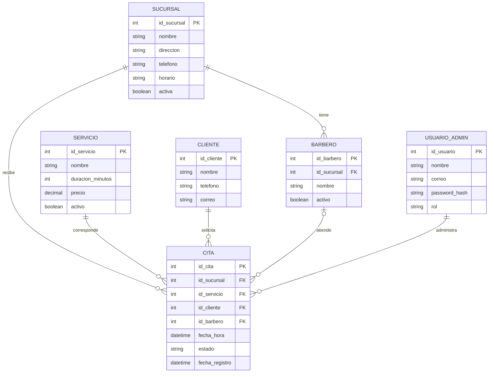

# Modelo entidad-relación preliminar

**Estado:** propuesta inicial pendiente de validación.

## Reglas preliminares

- Una cita pertenece a una sucursal, servicio y cliente.
- La asignación de barbero será opcional hasta confirmar esa función.
- Dos citas no podrán ocupar el mismo recurso en un horario incompatible.
- Los estados propuestos son: Pendiente, Confirmada, Completada y Cancelada.
- Las contraseñas nunca se almacenarán como texto sin protección.
