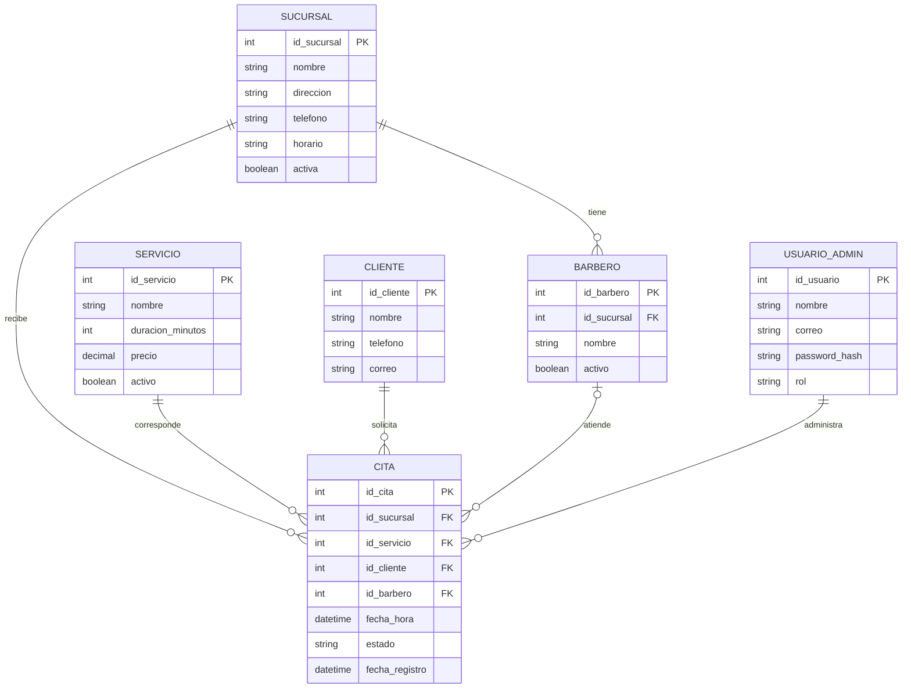

# Modelo entidad-relación preliminar

Es el modelo que propusimos el 1 de septiembre. La demostración actual solo guarda citas, la cuenta del administrador y las sesiones; barberos, clientes y servicios como tablas propias llegarán cuando tengamos los datos reales.

## Reglas del modelo

- Una cita pertenece a una sucursal, servicio y cliente.
- El barbero es opcional en la cita hasta que el negocio confirme cómo asignarlo.
- Dos citas no pueden traslaparse en el mismo recurso: por ahora la sucursal y, más adelante, el barbero.
- Los estados propuestos son: Pendiente, Confirmada, Completada y Cancelada.
- Las contraseñas nunca se guardan como texto plano.
