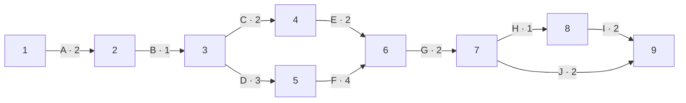

# Red PERT propuesta para el trabajo pendiente de Fase 2

**Fecha de preparación:** 29 de septiembre de 2026  
**Estado:** propuesta de planeación, pendiente de revisión por el equipo y el profesor. Las duraciones son estimaciones, no trabajo ya realizado ni fechas acordadas con el cliente.

El repositorio ya contiene un prototipo conectado con API, SQLite y panel administrativo. Esta red comienza con las actividades que faltan para adaptar esa demostración a información real y revisarla para la entrega de octubre. La fecha exacta de entrega no está registrada, por lo que se usan **días de trabajo relativos**, con el día 0 como inicio de la entrevista. La espera para conseguir cita con el cliente no está incluida.

## Actividades y precedencias

Las duraciones optimista, más probable y pesimista son supuestos para practicar PERT. En esta primera estimación son simétricas, por lo que el tiempo esperado `(O + 4M + P) / 6` coincide con M.

| Actividad | Trabajo pendiente | Predecesora | O | M | P | Esperado |
|---|---|---|---:|---:|---:|---:|
| A | Entrevistar al cliente sobre operación real | — | 1 | 2 | 3 | 2 |
| B | Registrar acuerdos y datos confirmados | A | 1 | 1 | 1 | 1 |
| C | Sustituir sucursales, servicios y contactos simulados | B | 1 | 2 | 3 | 2 |
| D | Definir capacidad, personal y reglas de reservación | B | 2 | 3 | 4 | 3 |
| E | Ajustar la interfaz a los datos confirmados | C | 1 | 2 | 3 | 2 |
| F | Adaptar API y disponibilidad a las reglas confirmadas | D | 3 | 4 | 5 | 4 |
| G | Ejecutar pruebas integrales con los cambios | E, F | 1 | 2 | 3 | 2 |
| H | Mostrar avance al equipo y al cliente, registrar observaciones | G | 1 | 1 | 1 | 1 |
| I | Corregir observaciones de la revisión | H | 1 | 2 | 3 | 2 |
| J | Preparar evidencia y documentación de la entrega | G | 1 | 2 | 3 | 2 |

La actividad C no significa que ya existan datos reales; depende de la entrevista #1. D y F modifican el sistema existente, no construyen de cero el backend que ya está implementado. El despliegue público se decidirá en #11 y no forma parte de esta red inicial.

## Red de actividades en flechas

Los cuadros numerados representan eventos y las flechas representan actividades. Las ramas E y F deben terminar antes de G. Las ramas I y J deben terminar antes de cerrar el proyecto. Este arreglo no requiere actividad ficticia.

## Tiempos de eventos

El TMC se calcula de izquierda a derecha tomando el máximo cuando confluyen flechas; el TML se calcula de derecha a izquierda tomando el mínimo cuando divergen. Para el último nodo se fija TML = TMC = 15.

| Nodo | TMC | TML |
|---:|---:|---:|
| 1 | 0 | 0 |
| 2 | 2 | 2 |
| 3 | 3 | 3 |
| 4 | 5 | 8 |
| 5 | 6 | 6 |
| 6 | 10 | 10 |
| 7 | 12 | 12 |
| 8 | 13 | 13 |
| 9 | 15 | 15 |

Por ejemplo, el TMC del nodo 6 es `max(5 + 2, 6 + 4) = 10`. El TML del nodo 3 es `min(8 - 2, 6 - 3) = 3`.

## Holguras y ruta crítica

Con la fórmula usada en clase, `Hᵢⱼ = Lⱼ − (Cᵢ + Tᵢⱼ)`, se obtiene:

| Actividad | Flecha | Cᵢ | Tᵢⱼ | Lⱼ | Holgura |
|---|---|---:|---:|---:|---:|
| A | 1 → 2 | 0 | 2 | 2 | 0 |
| B | 2 → 3 | 2 | 1 | 3 | 0 |
| C | 3 → 4 | 3 | 2 | 8 | 3 |
| D | 3 → 5 | 3 | 3 | 6 | 0 |
| E | 4 → 6 | 5 | 2 | 10 | 3 |
| F | 5 → 6 | 6 | 4 | 10 | 0 |
| G | 6 → 7 | 10 | 2 | 12 | 0 |
| H | 7 → 8 | 12 | 1 | 13 | 0 |
| I | 8 → 9 | 13 | 2 | 15 | 0 |
| J | 7 → 9 | 12 | 2 | 15 | 1 |

**Ruta crítica propuesta:** A → B → D → F → G → H → I, con **15 días de trabajo estimados** desde que empieza A. Las actividades C y E tienen tres días de holgura; J tiene uno. La suma de todas las duraciones es 21 días, pero no representa la duración del proyecto porque hay trabajo en paralelo.

Antes de usar esta red como compromiso de entrega, el equipo debe revisar duraciones, disponibilidad del cliente, responsables y la fecha límite. Si se decide incluir despliegue público, habrá que agregar actividades y recalcular la ruta crítica.
