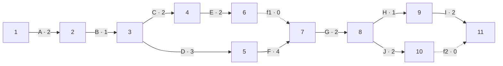

# Red PERT del trabajo pendiente (29 de septiembre de 2026)

Esta red la armamos el 29 de septiembre, en la actividad K del plan de la Fase 2, para estimar cuánto nos faltaba después de conectar la página con el servidor. En ese momento la entrevista con el dueño todavía no ocurría, así que es la actividad A.

**Qué pasó después:** la entrevista se hizo el 3 de octubre ([minuta](minuta-entrevista-cliente-2026-10-03.md)). El resto del trabajo lo pasamos a un calendario real en el [plan de continuidad](planificacion-fase2-2026-10-04.md), donde las actividades B a J de esta red se llaman O a W para no confundirlas con las del plan A–N. Conservamos esta página como registro del cálculo original.

Usamos días de trabajo relativos: el día 0 es el inicio de la entrevista y no contamos el tiempo de espera para conseguir la cita con el cliente.

## Actividades y precedencias

Las duraciones optimista (O), más probable (M) y pesimista (P) son estimaciones nuestras. En esta primera versión las pusimos simétricas, por eso el tiempo esperado `(O + 4M + P) / 6` sale igual a M.

| Actividad | Trabajo pendiente | Predecesora | O | M | P | Esperado |
|---|---|---|---:|---:|---:|---:|
| A | Entrevistar al cliente sobre la operación real | — | 1 | 2 | 3 | 2 |
| B | Registrar acuerdos y datos confirmados | A | 1 | 1 | 1 | 1 |
| C | Sustituir sucursales, servicios y contactos simulados | B | 1 | 2 | 3 | 2 |
| D | Definir capacidad, personal y reglas de reservación | B | 2 | 3 | 4 | 3 |
| E | Ajustar la interfaz a los datos confirmados | C | 1 | 2 | 3 | 2 |
| F | Adaptar la API y la disponibilidad a las reglas confirmadas | D | 3 | 4 | 5 | 4 |
| G | Ejecutar pruebas integrales con los cambios | E, F | 1 | 2 | 3 | 2 |
| H | Mostrar el avance al equipo y al cliente y anotar sus observaciones | G | 1 | 1 | 1 | 1 |
| I | Corregir las observaciones de la revisión | H | 1 | 2 | 3 | 2 |
| J | Preparar la evidencia y la documentación de la entrega | G | 1 | 2 | 3 | 2 |

D y F parten del servidor que ya existe; no se trata de construir el backend desde cero. Publicar el sistema en internet no entra en esta red: primero hay que decidir dónde alojarlo.

## Red de actividades en flechas

Usamos once eventos y dos actividades ficticias de duración cero, igual que en la hoja de apoyo del equipo. E y F tienen que terminar antes de G, e I y J antes del cierre.

## Tiempos de los eventos

El TMC se calcula de izquierda a derecha y, donde llegan varias flechas, se toma el mayor. El TML se calcula de regreso y, donde salen varias, se toma el menor. En el último nodo, TML = TMC = 15.

| Nodo | TMC | TML |
|---:|---:|---:|
| 1 | 0 | 0 |
| 2 | 2 | 2 |
| 3 | 3 | 3 |
| 4 | 5 | 8 |
| 5 | 6 | 6 |
| 6 | 7 | 10 |
| 7 | 10 | 10 |
| 8 | 12 | 12 |
| 9 | 13 | 13 |
| 10 | 14 | 15 |
| 11 | 15 | 15 |

Por ejemplo, el TMC del nodo 7 es `max(7 + 0, 6 + 4) = 10`, y el TML del nodo 10 es 15 porque f2 llega al nodo 11 sin duración. Al revisar la hoja del equipo corregimos dos cosas: ahí el TML del nodo 10 aparecía como 14 y faltaba contar la segunda llegada al nodo 7.

## Holguras y ruta crítica

Con la fórmula de clase, `Hᵢⱼ = Lⱼ − (Cᵢ + Tᵢⱼ)`:

| Actividad | Flecha | Cᵢ | Tᵢⱼ | Lⱼ | Holgura |
|---|---|---:|---:|---:|---:|
| A | 1 → 2 | 0 | 2 | 2 | 0 |
| B | 2 → 3 | 2 | 1 | 3 | 0 |
| C | 3 → 4 | 3 | 2 | 8 | 3 |
| D | 3 → 5 | 3 | 3 | 6 | 0 |
| E | 4 → 6 | 5 | 2 | 10 | 3 |
| F | 5 → 7 | 6 | 4 | 10 | 0 |
| f1 | 6 → 7 | 7 | 0 | 10 | 3 |
| G | 7 → 8 | 10 | 2 | 12 | 0 |
| H | 8 → 9 | 12 | 1 | 13 | 0 |
| I | 9 → 11 | 13 | 2 | 15 | 0 |
| J | 8 → 10 | 12 | 2 | 15 | 1 |
| f2 | 10 → 11 | 14 | 0 | 15 | 1 |

La ruta crítica es **A → B → D → F → G → H → I** y dura 15 días de trabajo desde que empieza la entrevista. C, E y f1 tienen tres días de holgura; J y f2, uno. Las duraciones suman 21 días, pero el proyecto no dura eso porque varias actividades van en paralelo.

Sin la entrevista, que ya se hizo, el trabajo restante (B a J) dura 13 días. Es la misma ruta que aparece en el plan de continuidad como O–Q–S–T–U–V.
